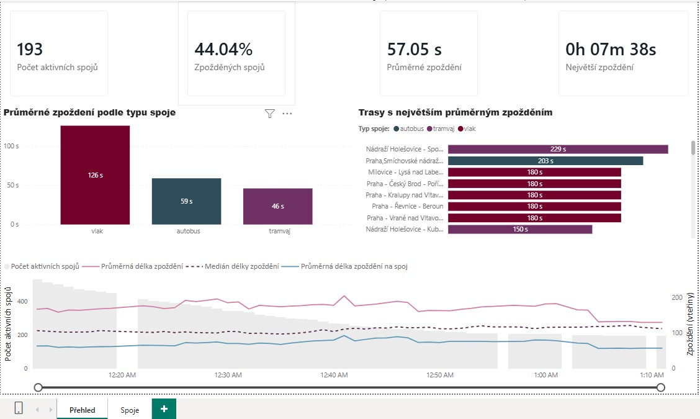
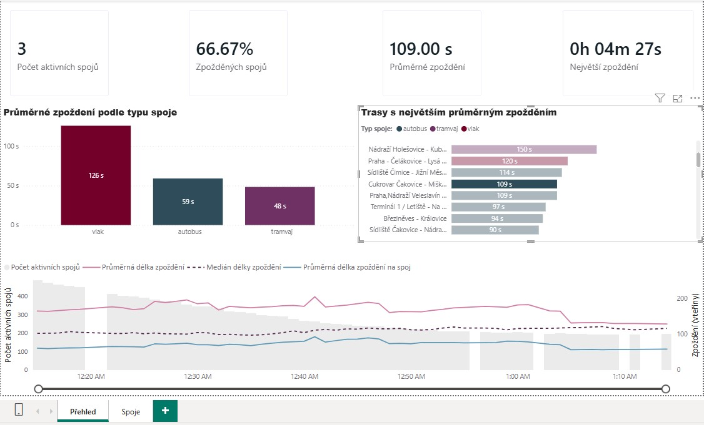
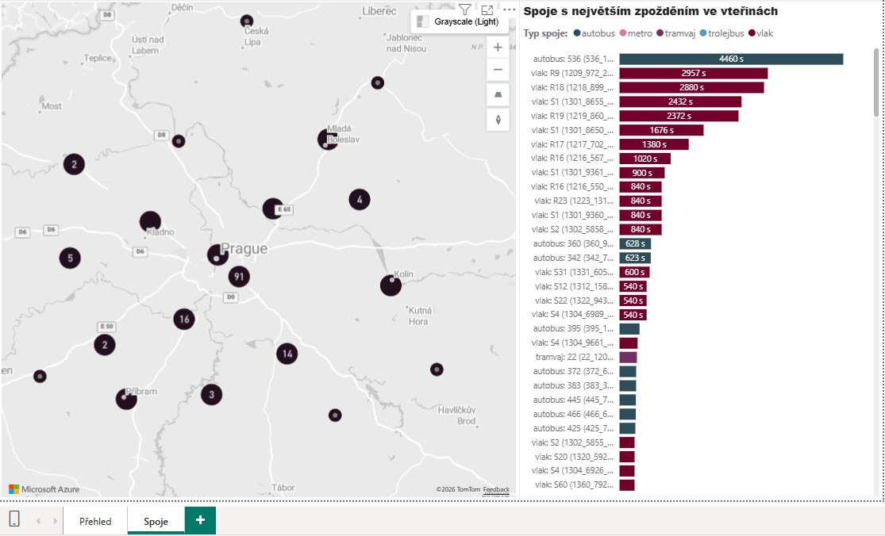
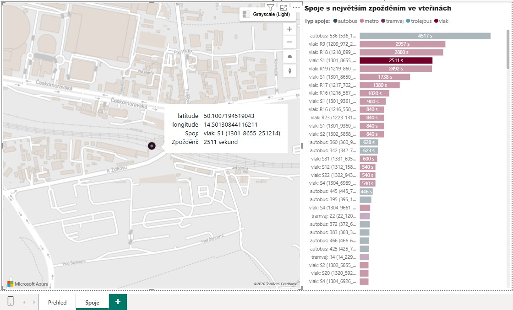
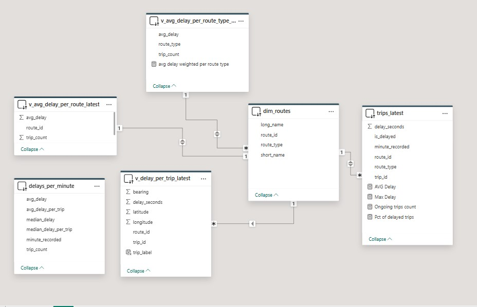

# 🚍 Real-time Public Transport Delay Monitoring  

**GTFS-RT → Python → PostgreSQL → Power BI (DirectQuery)**  

End-to-end near-real-time data engineering project that ingests live Prague public transport (PID) data, stores rolling historical snapshots in PostgreSQL, and serves Power BI dashboards via DirectQuery.

## Features

- Real-time ingestion pipeline processing ~3,500 live vehicle/trip updates every minute. 
- Rolling 60-minute historical storage
- Star-schema inspired data model
- Power BI DirectQuery dashboard
- Drill-through analysis
- Live vehicle map

## Data Flow

1. GTFS-RT feed (Trip Updates + Vehicle Positions)  
2. Python ingestion layer  
3. PostgreSQL (facts + dimensions + analytical views)  
4. Power BI (DirectQuery)

Ingestion is triggered every minute by Windows Task Scheduler running .bat script.

## Data Source

- [Golemio + Prague Integrated Transport (PID)](https://api.golemio.cz/pid/docs/openapi/#/) – public API  

## Tech Stack

| Layer | Technology |
|-------|------------|
| Ingestion | Python (requests, protobuf, psycopg2) |
| Storage | PostgreSQL |
| Modeling | Fact + Dimension tables, SQL Views |
| Scheduling | Windows Task Scheduler |
| BI | Power BI (DirectQuery) |
| Logging | Python logging module |

## Data Modeling

### Fact Tables

**fact_trip_delay_1min**  

- Grain: 1 row / trip / minute  
- Primary Key: `(trip_id, minute_recorded)`  
- Sliding window: last 60 minutes  
- Indexed: `(route_id, minute_recorded)` and `(minute_recorded DESC)`  

**fact_vehicles_pos**  

- Grain: 1 row / trip (snapshot)  
- TRUNCATE + INSERT each run  
- Used for map visualization in Power BI  

### Dimension Table

**dim_routes**

- `route_id`, `long_name`, `short_name`, `route_type`  
- Route types mapped via `route_types.json`  


## SQL Analytical Layer (Views)

The reporting model combines SQL views with selected fact and dimension tables.

SQL views provide pre-aggregated datasets for DirectQuery performance:

- **v_trips_latest** – latest snapshot of all trips + `dim_routes` joined
- **v_delays_per_minute** – minute-level aggregations: count, average, median, non-zero median  
- **v_avg_delay_per_route_latest** – average delay per route and trip count
- **v_avg_delay_per_route_type_latest** – average delay per route type and trip count
- **v_delay_per_trip_latest** – delayed trips + vehicle GPS  
 

## Ingestion Logic

### Trip Updates

- Feed: `trip_updates.pb`  
- Extract max delay per trip  
- Ignore delays < 60s  
- Cap extreme delays (> 10000s)  
- UPSERT to `fact_trip_delay_1min`  

### Vehicle Positions

- Feed: `vehicle_positions.pb`  
- TRUNCATE snapshot table + INSERT current positions  

### Dim Routes Update

- Fetch route info  
- TRUNCATE + INSERT

  
  This update is run manually since routes don't change as often.

## Power BI Report (DirectQuery)

- Aggregations are split between SQL and DAX:

| Calculation type | Layer |
|-----------------|-------|
| Median, minute-level aggregates | SQL |
| Count of trips, % delayed trips, Weighted averages | DAX |

Bar visuals must use weighted average so that drill through doesn`t calculate average out of averages. 
Example DAX measure:
``` avg delay weighted per route type =
DIVIDE(
    SUMX(v_avg_delay_per_route_type_latest,
        v_avg_delay_per_route_type_latest[avg_delay] *
        v_avg_delay_per_route_type_latest[trip_count]),
    SUM(v_avg_delay_per_route_type_latest[trip_count])
)
```

### Page 1 – Overview



Drill through:



- KPI cards: active trips count, % delayed trips, average delay, max delay
- Bar charts: average delay per transport type & per route (drill-through affects KPI cards)  
- Line chart: last 60 minutes – avg delay, avg delay per trip, median of delay, trip count  

### Page 2 – Delayed trips and their location



Drill through:


### Model View


